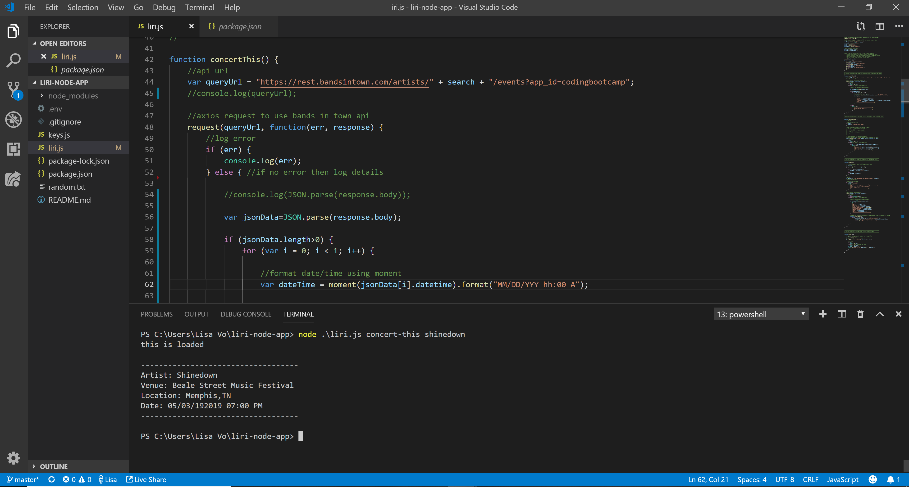

# liri-node-app
LIRI is like iPhone's SIRI. However,LIRI is a Language Interpretation and Recognition Interface. LIRI will be a command line node app that takes in parameters and gives you back data.

# Contributors
@thuyngavo

# About
The user can write one of the 4 commands:

- node liri.js concert-this "artist name" :: This will search the Bands in Town Artist Events API and display the name of the concert venue, location, and the date/time of the concert.

- node liri.js spotify-this-song "Song Name" :: This allows users to Search a song and display the artist name, song name a preview link on spotify and the album name. If no song name is given then a default response for The Sign by Ace of Base will be given.

- node liri.js movie-this "movie" :: This Allows users to Search OMDB for detailed nformation on a desired movie. If no movie given, then a default reply for Mr Nobody will be given. 

- node.js liri do-what-it-says :: This allows the user to run a command that is written inside the random.txt document.

# Contact
- Homepage: https://github.com/thuyngavo/thuyngavo.github.io
- e-mail: lisa.vo49@gmail.com
- LinkedIn: https://www.linkedin.com/in/lisa-vo-86a94341/